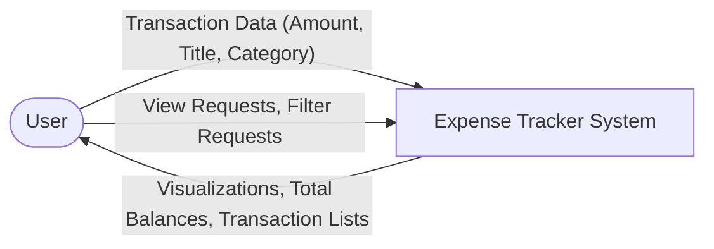
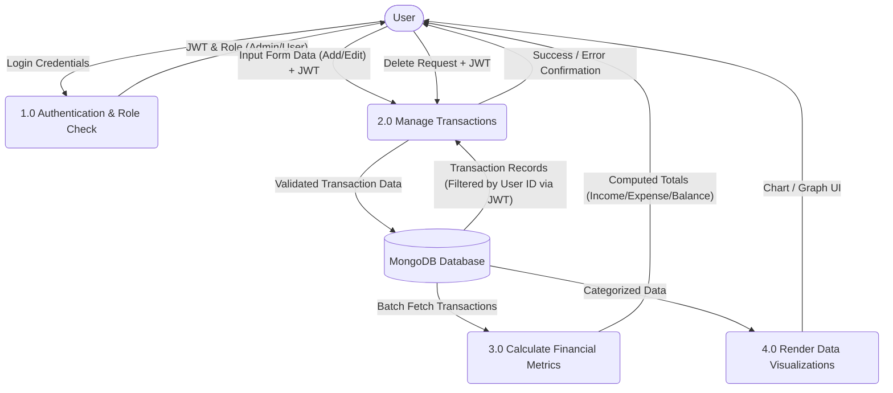
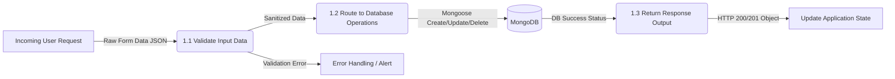
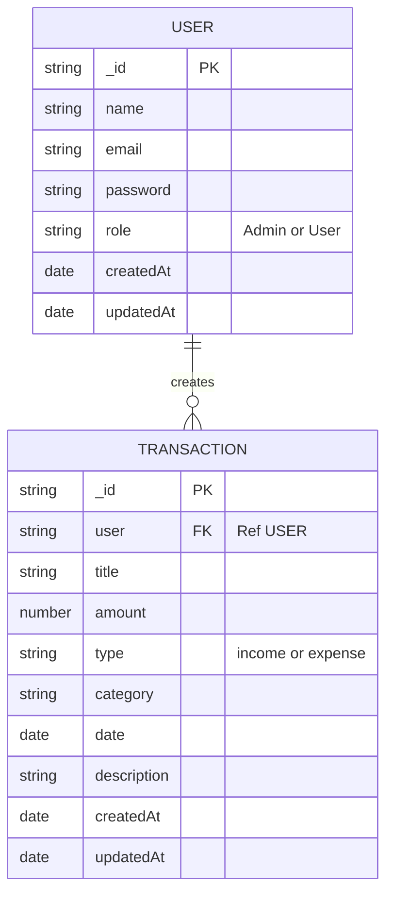

# Data Flow Diagrams (DFD) for Expense Tracker

This document provides visual representations of how data flows through the Expense Tracker system.
These diagrams use standard Mermaid.js syntax.

## Level 0 Context DFD
This diagram shows the entire system as a single process interacting with external entities (The User).

## Level 1 DFD
This details the main sub-processes within the system: Input Management, Dashboard Calculation, and the Database Storage.

## Level 2 DFD (Process: 1.0 Manage Transactions)
 Breaking down Process 1.0 into smaller functional units focusing on validation and routing.

## Entity Relationship Diagram (ERD) Overview

